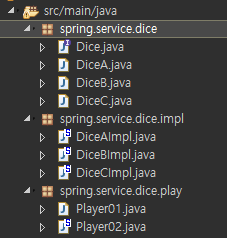
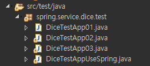

# DI

## 1. java package

#### 컴포넌트, DAO와 같은 java소스파일 저장


#### 테스트를 위한 java소스파일 저장


#### bean 설정파일, properties파일 저장


## 2. dice service 설정파일(xml)

```
<?xml version="1.0" encoding="UTF-8"?>
<beans xmlns="http://www.springframework.org/schema/beans"
	xmlns:xsi="http://www.w3.org/2001/XMLSchema-instance"
	xsi:schemaLocation="http://www.springframework.org/schema/beans http://www.springframework.org/schema/beans/spring-beans.xsd">
	<!-- xml설정문서에서는 bean의 실제클래스만 사용됨 | 클래스 소스에서는 인터페이스 명만 사용됨! -->

	<!-- 1. diceA, diceB, diceC라는 이름으로 각각의 주사위 bean을 등록 -->
	<bean id="diceA" class="spring.service.dice.impl.DiceAImpl"/>
	<bean id="diceB" class="spring.service.dice.impl.DiceBImpl"/>
	<bean id="diceC" class="spring.service.dice.impl.DiceCImpl"/>

	<!-- 2. player01이라는 이름의 반을 생성 :: DiceA를 생성자로 주입-->
	<bean id="player01" class="spring.service.dice.play.Player02">
		<constructor-arg ref="diceA"/>
	</bean>

	<!-- 2. player02이라는 이름의 반을 생성 :: DiceB를 setter로 주입-->
	<bean id="player02" class="spring.service.dice.play.Player02">
		<property name="dice" ref="diceB"/> <!-- player02.setDice(diceB) -->
	</bean>

	<!-- 3. player03이라는 이름의 반을 생성 :: DiceC를 setter로 주입-->
	<bean id="player03" class="spring.service.dice.play.Player02">
		<property name="dice" ref="diceC"/>
	</bean>

	<!-- 4. player04이라는 이름의 반을 생성 :: DiceA를 생성자로 주입-->
	<bean id="player04" class="spring.service.dice.play.Player02">
		<constructor-arg ref="diceA"/>
	</bean>
</beans>
```

## 3. Dice Bean

#### - <u>Dice 인터페이스</u>

```
package spring.service.dice;

public interface Dice {
	public int getValue();
	public void selectedNumber();
}
```

#### - <u>Dice A, B, C impl</u>

> A,B,C 코드 동일...

```
package spring.service.dice.impl;

import java.util.Random;

import spring.service.dice.Dice;

public class DiceAImpl implements Dice{
	private int value;

	public DiceAImpl() {
		System.out.println("::"+getClass().getName()+"생성자...");
	}

	@Override
	public int getValue() {
		return value;
	}

	@Override
	public void selectedNumber() {
		value = new Random().nextInt(6) + 1;
	}

}

```

## 4. Player(주사위를 가지고 있는...)

> FileName : Player01.java
> ㅇDiceA 을 가지고(?, has a :: Association Relationship)있는 Player Object Modeling
> ㅇDiceA 를 사용 합을 리턴하는 Method 정의

```
package spring.service.dice.play;

import spring.service.dice.Dice;

public class Player02 {

	///Field
	private Dice dice;
	private int totalValue;

	///Constructor Method
	public Player02() {
	}

	public Player02(Dice dice) {
		this.dice = dice;
	}

	///Method (getter/setter)
	public Dice getDice() {
		return dice;
	}
	public void setDice(Dice dice) {
		this.dice = dice;
	}
	public int getTotalValue() {
		return totalValue;
	}
	public void setTotalValue(int totalValue) {
		this.totalValue = totalValue;
	}

	//==> count 만큼 주사위를 굴려서 합을 후하는 행위
	public void playDice(int count){

		System.out.println("==>"+getClass().getName()+".playDice() start....");

		for (int i = 0; i < count; i++) {
			dice.selectedNumber();
			System.out.println("::[ "+dice.getClass().getName()+" ] 의 선택된수 : "+dice.getValue());
			totalValue += dice.getValue();
		}

		System.out.println("==>"+getClass().getName()+".playDice() end....");
	}

}//end of class
```

## 5. 테스트 코드

```
package spring.service.dice.test;

import org.springframework.context.ApplicationContext;
import org.springframework.context.support.ClassPathXmlApplicationContext;

import spring.service.dice.play.Player02;
public class DiceTestAppUseSpring {
	public static void main(String[] args) {
		ApplicationContext factory =
				 new ClassPathXmlApplicationContext("config/diceservice.xml");
		//xml 하나씩 하면서 이곳에서 하나씩 테스트한다...
		Player02 player01 = (Player02)factory.getBean("player01");
		player01.playDice(3);
		System.out.println("======================");
		System.out.println("선택된 주사위 수의 통합은 :"+ player01.getTotalValue());
		System.out.println("=============\n\n");

		Player02 player02 = (Player02)factory.getBean("player02");
		player02.playDice(3);
		System.out.println("======================");
		System.out.println("선택된 주사위 수의 통합은 :"+ player02.getTotalValue());
		System.out.println("=============\n\n");


		Player02 player03 = (Player02)factory.getBean("player03");
		player03.playDice(3);
		System.out.println("======================");
		System.out.println("선택된 주사위 수의 통합은 :"+ player03.getTotalValue());
		System.out.println("=============\n\n");

		Player02 player04 = (Player02)factory.getBean("player04");
		player04.playDice(3);
		System.out.println("======================");
		System.out.println("선택된 주사위 수의 통합은 :"+ player04.getTotalValue());
		System.out.println("=============\n\n");

	}

}//end of class
```
