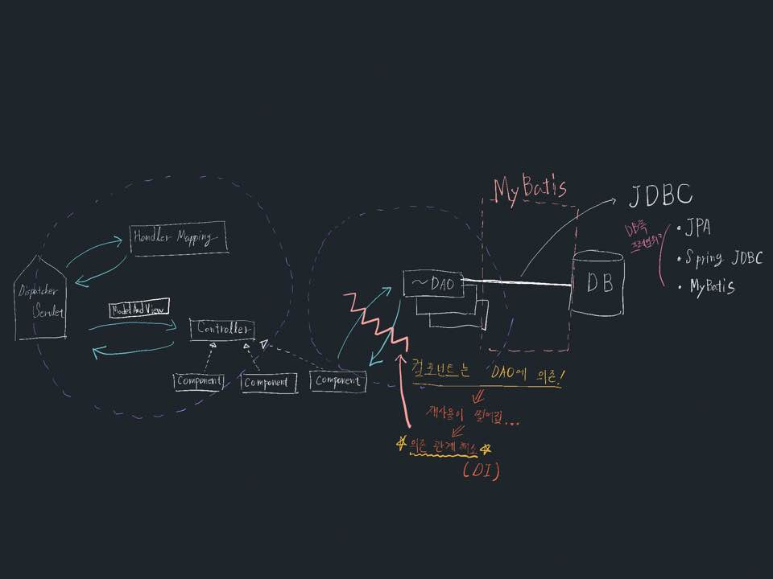
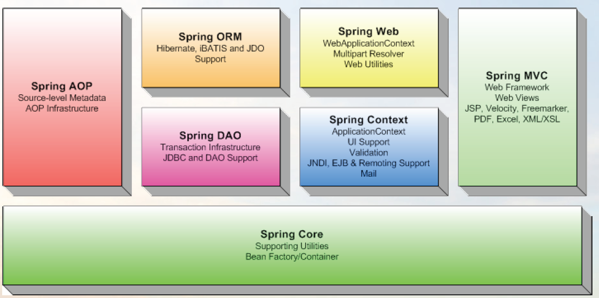

# Spring Framework

## 1. 배경


```
기존의 서블릿 구조에서는 중복된 작업이 많았다. 
특히 컴포넌트는 1개당 DAO를 1개를 가지는 has-a 관계이므로 새로운 컴포넌트가 생길 때마다
DAO또한 생성해야 하고 이를 다른 곳에 재사용하기에도 부적절하다.
컴포넌트와 DAO간의 has-a관계를 끊기 위해(DI) 적절할 조치가 필요하다.
```

- **DI** (Dependency Injection)
  - **interface**생성
    ```
    interface객체를 통해 자식 객체들을 가리키도록 하여 객체의 재사용성이 가능하도록 하였다. 
    하지만 여전히 new 키워드를 통해 새로운 객체를 생성한다는 점에서 DI를 만족하지 못한다.
    ```
    `=>[Spring Container]:https://github.com/BlackMonkey56/SPRING_STUDY/tree/master/Spring%20Container사용 (IOC: Inversion of Controller; 제어의 역전)`


